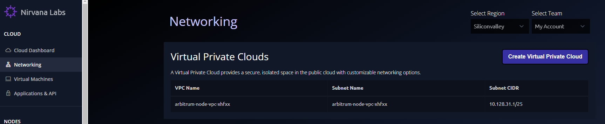
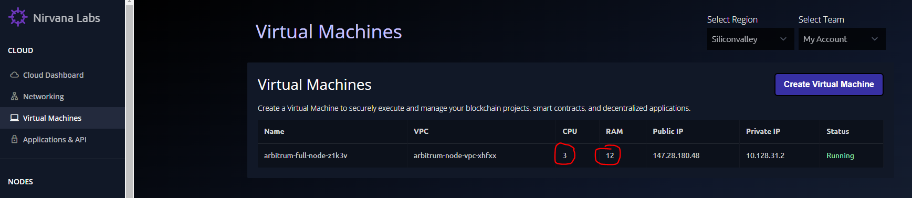
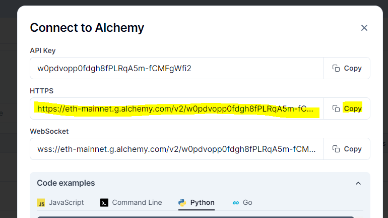

# Configure a Node to Connect to Arbitrum Mainnet

This is the list of activities carried out to create a new Node and configure it for the Arbitrum Mainnet.

## Steps
#### 1. Create a node in Nirvana Labs
        a) Create a VPC "arbitrum-node-vpc"

        b) Create a Key-Pair to use for SSH
            #ssh-keygen
        c) Create a VM with the specification given in "https://docs.arbitrum.io/node-running/how-tos/running-a-full-node"

        c) SSH into the node
            #ssh -i .ssh/nirvana-labs ubuntu@147.28.180.48
#### 2. Create Alchemy Application and get the "parent-chain.connection.url"
        a) Register for Alchemy
        b) Create an Application with "Ethereum" chain and "Mainnet" Network
        c) View the API Key details and extract the parent chain connection url

#### 3. Configure Node for Arbitrum
        a) Install Docker
            #sudo apt install docker.io
        b) Create directory "/home/ubuntu/arbitrum" and provide full access
            #mkdir /home/ubuntu/arbitrum
            #chmod -Rf 777 /home/ubuntu/arbitrum
            #sudo usermod -aG docker $USER
            Exit and log in again to affect the permissions
        c) Get the L2 chain id 42170 for Nova from "https://docs.arbitrum.io/node-running/node-providers#rpc-endpoints"
        d) Run the docker command
        docker run --rm -it -d -v /home/ubuntu/arbitrum:/home/user/.arbitrum -p 0.0.0.0:8547:8547 -p 0.0.0.0:8548:8548 offchainlabs/nitro-node:v2.2.5-a20a1c7 --parent-chain.connection.url https://eth-mainnet.g.alchemy.com/v2/w0pdvopp0fdgh8fPLRqA5m-fCMFgWfi2 --chain.id=42170 --http.api=net,web3,eth,debug --http.corsdomain=* --http.addr=0.0.0.0 --http.vhosts=* --init.url="https://snapshot.arbitrum.foundation/nova/nitro-pruned.tar"

